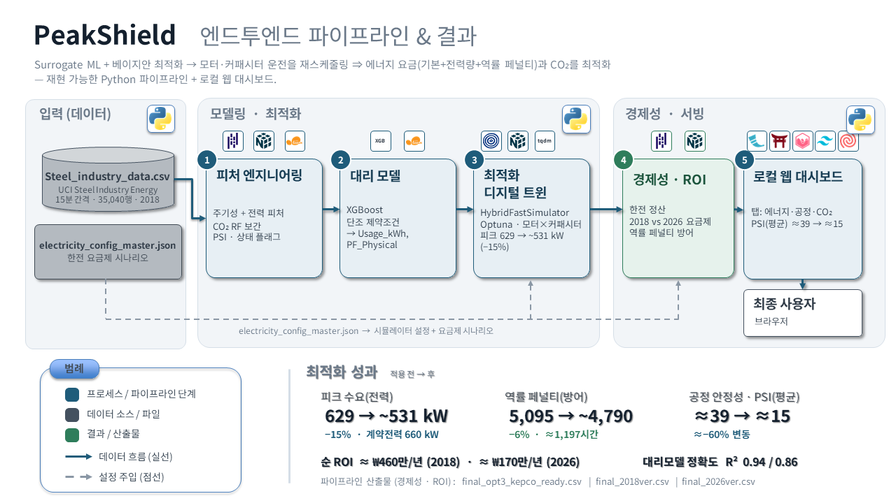

# PeakShield — 철강 공정 전력 피크 절감·비용 최적화

*[English](README.md) · 한국어*

> **기술 스택:** Python · pandas · NumPy · scikit-learn · XGBoost · Optuna · Flask · Chart.js · Tailwind CSS

철강 공정의 15분 단위 전력 사용량 데이터를 기반으로, **Surrogate(대리) ML 모델 + 베이지안 최적화(Optuna)** 로
모터/콘덴서 가동률을 재스케줄링하여 **전기요금(기본료·전력량요금·역률 페널티)과 탄소배출을 최소화**하는
디지털 트윈 시뮬레이션 프로젝트입니다.

분석 전 과정을 **재현 가능한 Python 파이프라인**(재사용 모듈 + 단계별 실행 스크립트)으로 구성했습니다.

## 주요 결과

> 기본 시나리오(`*_opt3`, 2018·2026) 기준. 파이프라인 산출물(`reports/`, `data/processed/sim_*.parquet`)로 검증.

- **피크 수요 −15%** — 629 → 531 kW (계약전력 660 kW)
- **역률 페널티 −6%** — 5,095 → 4,788 구간 (15분; ≈1,274 → 1,197시간)
- **공정 안정성** — PSI(평균) ≈39 → ≈15
- **순 ROI** — 약 ₩4.6M/년 (2018) · 약 ₩1.7M/년 (2026)
- **대리모델 정확도** — R² 0.94 / 0.86 (Usage_kWh / PF_Physical)

## 시스템 아키텍처



---

## 프로젝트 구조

```
PeakShield/
├─ config/
│   └─ electricity_config_master.json   # 한전 요금제(8개 시나리오): TOU/단가/역률규정/base_rate
├─ data/
│   ├─ raw/        Steel_industry_data.csv      # 입력 (UCI Steel Industry Energy, 35,040행)
│   └─ processed/  # 파이프라인 산출물 (gitignore)
├─ models/         # 학습된 XGBoost 모델 (gitignore)
├─ reports/        # 평가 그림/표 (gitignore)
├─ src/            # 재사용 모듈 (plot 없음, 순수 로직)
│   ├─ config.py             경로·컬럼명·피처 목록·상수
│   ├─ data_loading.py       CSV 로드 + 컬럼 재명명 + 시간 정렬
│   ├─ preprocessing.py      시간/순환(sin·cos)/전력 파생 피처
│   ├─ co2_imputation.py     센서 고장(1월 화요일 CO2=0) RandomForest 복원
│   ├─ operating_flag.py     가동상태 플래그(0 OFF / 1 Wait / 2 Production)
│   ├─ psi.py                공정 스트레스 지수(PSI) 산출 + AI 전후 비교
│   ├─ surrogate_model.py    Usage_kWh·PF_Physical XGBoost 학습/저장/평가
│   ├─ simulator.py          HybridFastSimulator (그리드 사전연산 + Optuna 미세조정)
│   ├─ economics.py          한전 역률 페널티·재무 ROI·실시간 요금
│   ├─ settlement.py         전압/요금제 조합 최저비용 정산 (kepco_bill 구현)
│   └─ dashboard_export.py   대시보드용 스트리밍 CSV 생성
├─ scripts/        # 실행 진입점 (순서대로)
│   ├─ 01_build_features.py
│   ├─ 02_train_surrogate.py
│   ├─ 03_run_optimization.py
│   ├─ 04_evaluate_roi.py
│   └─ 05_export_dashboard.py
├─ dashboard/      # Flask 실시간 대시보드 (단일 페이지 3탭)
│   ├─ app.py      전기료·CO2 서버 :5001 — "공정" 탭은 4444를 iframe 임베드
│   ├─ sender.py   결과 CSV를 1초 간격으로 /ingest 에 송신
│   ├─ static/  templates/
│   └─ process_app/   # 공정 흐름 전용 서버 :4444 (5001의 공정 탭이 임베드)
│       ├─ app.py  static/  templates/
├─ docs/           # 아키텍처 다이어그램 (en / ko)
└─ notebooks/      # 탐색적 분석(EDA)·시각화 노트북
```

## 데이터 흐름

```
data/raw/Steel_industry_data.csv
        │  01_build_features.py
        ▼
data/processed/features.parquet  (+ reactive_maxima.json)
        │  02_train_surrogate.py
        ▼
models/usage_model.json, models/pf_model.json
        │  03_run_optimization.py   (config 시나리오별)
        ▼
data/processed/sim_<scenario>.parquet
        │  04_evaluate_roi.py        05_export_dashboard.py
        ▼                                  ▼
reports/ + final_opt3_kepco_ready.csv   final_2018ver.csv / final_2026ver.csv
                                                │  dashboard/sender.py → app.py
                                                ▼
                                        실시간 대시보드 (http://127.0.0.1:5001)
```

## 빠른 시작

```bash
python -m venv venv && source venv/bin/activate
pip install -r requirements.txt

# 전체 파이프라인 (기본 시나리오: 2018·2026 opt3)
python scripts/01_build_features.py
python scripts/02_train_surrogate.py
python scripts/03_run_optimization.py
python scripts/04_evaluate_roi.py
python scripts/05_export_dashboard.py

# 대시보드 — 세 앱/프로세스를 모두 실행 (터미널 3개)
cp .env.example .env                  # DATA_GO_KR_SERVICE_KEY 채우기
python dashboard/app.py               # 전기료·CO2 서버 → http://127.0.0.1:5001
python dashboard/sender.py            # 실시간 송신
python dashboard/process_app/app.py   # 공정 서버 → http://127.0.0.1:4444
```

> 셋을 모두 띄운 뒤 **http://127.0.0.1:5001 한 곳**에 접속하면, 단일 페이지의 3개 탭
> (전기료·공정·CO2)이 동작합니다. **"공정" 탭은 4444 앱을 iframe으로 임베드**하여
> (탭 첫 클릭 시 로드) 구현 형식이 다른 두 앱을 한 화면처럼 보여줍니다. 임베드 주소는
> `PROCESS_APP_URL` 환경변수로 변경 가능하며, 단일 origin·포트가 필요하면 리버스 프록시(Nginx 등)도 옵션입니다.

## 요금 시나리오 (config/electricity_config_master.json)

8개 시나리오: `2018_industrial_HV_A_opt{1,2,3}`, `2026_standard`, `2026_jeju`,
`2026_industrial_HV_A_opt{1,2,3}`. 각 시나리오는 `base_rate`, 계절별 `tou_schedule`/`unit_prices`,
역률 규정 `pf_logic`(lag/lead target, 적용 시간대), `additional_fees`(기후·연료·기금·부가세)를 가집니다.
기본 분석은 `*_opt3`(2018/2026) 시나리오를 사용합니다.

## 데이터 출처

`data/raw/Steel_industry_data.csv` — UCI Machine Learning Repository,
*Steel Industry Energy Consumption* (DAEWOO Steel Co., 2018, 15분 단위).

## 알려진 의존성/제약

- **`src/settlement.py`의 `kepco_bill_300kw_plus()`** 는 2025.04.01 시행 300kW 이상
  산업용(을) 요금표(고압 A/B/C × 선택 I/II/III)로 구현되어, 월별 **최저비용 조합 탐색
  정산**(`settlement_kepco_after_optimization`)이 동작합니다. 이는 메인 ROI
  (`economics.calculate_advanced_financial_roi`)와 **독립적인 정밀 정산 도구**입니다.
- 한글 차트 폰트는 EDA·시각화에서만 필요합니다(`src`는 plot 미포함).
- 대시보드의 공공데이터 인증키는 환경변수(`DATA_GO_KR_SERVICE_KEY`)로 분리되어 있습니다.

## 팀 & 기여

3인 팀. 데이터/디지털 트윈 · 경제성/프론트엔드 · 모델링으로 역할 분담.

- **김명선 ([@myeongsun125](https://github.com/myeongsun125))** — 프로젝트 리드 & 데이터/디지털 트윈. 팀을 이끌며 프로젝트 방향과 최종 발표·프로젝트 내러티브를 주도. 기술 기여: 피처 엔지니어링(결측치 보간·공정상태 모델링), EDA·데이터 시각화, SVG 기반 디지털 트윈 공정 탭, UI 아키텍처 설계.
- **송병갑 ([@sbg0700](https://github.com/sbg0700))** — 경제성 엔진 & 프론트엔드. 타겟 피처 엔지니어링, KEPCO 전기요금 산출 함수, 탄소배출권 가격 API 연동, 대시보드 프론트엔드(전기료·탄소 탭).
- **권영민 ([@Kwonym0814](https://github.com/Kwonym0814))** — 모델링 & 최적화. XGBoost 대리모델 하이퍼파라미터 탐색(Grid-search · Optuna), 모델 파인튜닝.

## 라이선스

이 프로젝트는 MIT 라이선스를 따릅니다 — 자세한 내용은 [LICENSE](LICENSE) 파일을 참고하세요.
